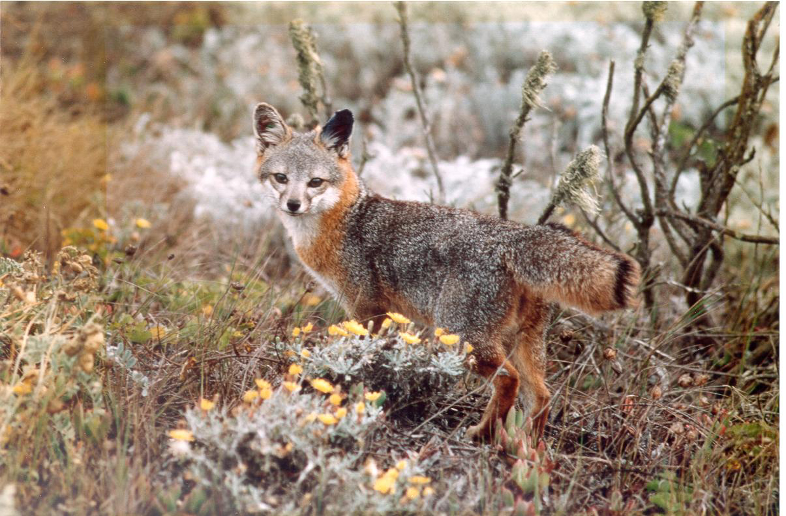

```{r setup, include=FALSE}
knitr::opts_chunk$set(echo = TRUE)

library(tidyverse)

dat <- readRDS("data/2013-2014_recovery_report_clean_v1.rds")
```

Recovering species listed as threatened or endangered under the Endangered Species Act (ESA) requires funding. Here we provide a brief review of the estimated costs of recovering species under the ESA, including one published estimate and one estimate we derive from the most recently available data.

<figure class="figure">
  
  <figcaption class="figure-caption">Photo courtesy of National Park Service.</figcaption>
</figure>


## Gerber (2016) estimate

The first estimate comes from [Leah Gerber’s 2016 paper](https://www.pnas.org/content/113/13/3563) on conservation triage under the ESA^[Gerber, L. R. Conservation triage or injurious neglect in endangered species recovery. Proc. Natl. Acad. Sci. U. S. A. 113, 3563–3566. (2016).], placing the cost of recovery at $1.21 billion per year. That estimate was based on recovery cost data from 2010 and for about 1,100 species; somewhat dated, but the estimate is consistent with our own calculations below. Further, this and any estimate based on the recovery plan cost estimates is likely a conservative estimate: Gerber noted that the cost to recover 15 species delisted because of recovery as of late 2015 was 74% higher than the recovery plan estimates. If that pattern held across still-listed species and the cost accrues on an annual basis, then we estimate the need at $2.26 billion per year per Gerber’s estimate^[$1.21 billion x 1.74 = `r paste0("$", 1210000000*1.74)`].

## Updated estimate

To update Gerber’s calculation, we derived an independent estimate using the [2013-2014 recovery report to Congress](https://www.fws.gov/endangered/esa-library/pdf/Recovery_Report_FY2013-2014.pdf); see [Calculations, below](#calculations). Using the per-species cost of recovery and the time-to-recovery data in the report, we estimate the total cost of recovery at **$1.62 billion per year**. In brief, the total recovery cost is estimated at $9.4 billion for 481 species with estimates in the report, for an estimated per-species cost of approximately $19.5 million. Multiplying the per-species cost by the count of 1,662 currently listed species, we estimate total recovery cost for ESA-listed species at $32.5 billion. Dividing that by the median time-to-recovery of 20 years—also calculated from the recovery report—we estimate $1.62 billion per year to carry out the recovery actions needed for all current ESA-listed species. 

## Funding sources

A key value judgement that science cannot answer is how much different parties should contribute to the recovery of ESA-listed species. We can, however, consider patterns of past expenditures to help inform current and future allocations. Of the ~$1.4 billion in compliance and recovery expenditures reported in 2016, 80.3% came from other federal agencies, 13.4% from FWS, and 6.3% was reported by the States^[https://defenders-cci.org/analysis/ESA_funding/]. Under the North American model - that is, a model of wildlife management and conservation led by the States - this seems like a very skewed distribution^[However, because we cannot separate compliance and recovery expenditures from the available data, the skew of recovery contributions may be considerably reduced for recovery.]. 

## Conclusion

In short, both peer-reviewed published research and our own updated calculations from available recovery costs **data put the cost of ESA recovery at over $1 billion per year.** Filling this need will require that the sources of recovery funding be sustainable and balanced among various responsible parties.

## Calculations
```{r per-spp}
summary(dat$est_time_recov_num)
median_est_time <- median(dat$est_time_recov_num, na.rm = TRUE)

# total estimated recovery cost for spp *with* estimates
sum(dat$cost_per_spp, na.rm = TRUE)

# estimated cost per spp
est_per_spp <- sum(dat$cost_per_spp, na.rm = TRUE) / sum(!is.na(dat$cost_per_spp))
overall_est_past <- est_per_spp * length(dat$species)
overall_est_cur <- est_per_spp * 1662
overall_est_cur / median_est_time

# Now let's get some confidence intervals:
with_est <- filter(dat, !is.na(dat$cost_per_spp))
resamp_vals <- lapply(1:1000, FUN = function(x) {
  re <- sample_n(with_est, size = 481, replace = TRUE)
  tot_cost <- sum(re$cost_per_spp) / 481
  return(tot_cost)
}) %>% unlist()

quantile(resamp_vals, c(0.01, 0.025, 0.05, 0.25, 0.5, 0.75, 0.95, 0.975, 0.99))
quantile(resamp_vals, c(0.025, 0.975))
LCL <- quantile(resamp_vals, 0.025) * 1662
UCL <- quantile(resamp_vals, 0.975) * 1662
LCL / median_est_time
UCL / median_est_time
```

